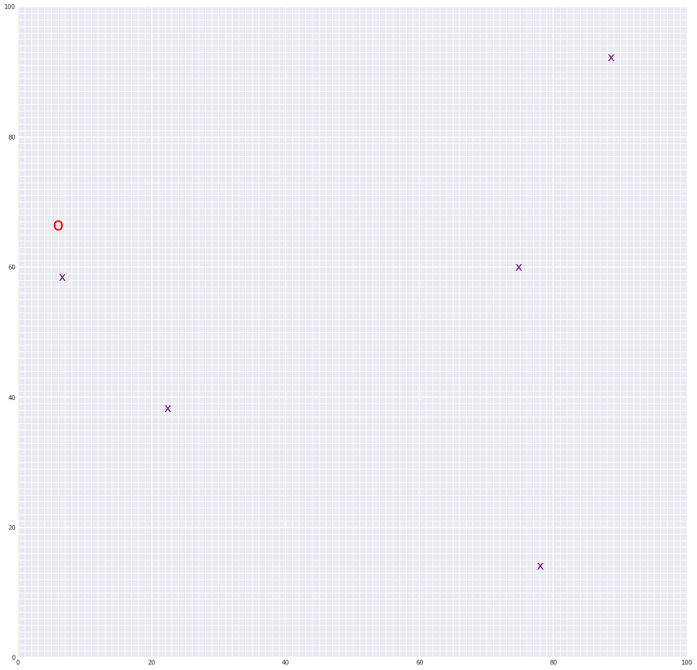

# Landmark Detection & Robot Tracking (SLAM)

### Overview

This project implements a SLAM (Simultaneous Localization and Mapping) algorithm for localizing a robot that moves and senses in a 2D grid world. 

The basis for SLAM is to gather information from a robot's sensors and motions over time, and then use information about measurements and motion only to re-construct a map of the world.

SLAM makes it possible to track the location of a robot in the world and identify the locations of landmarks such as buildings, trees, rocks, and other world features in real-time.

This is an active area of research in the fields of robotics and autonomous systems. Since this localization and map-building relies on the visual sensing of landmarks, this is a computer vision problem.

### Notebooks

The project will be broken up into three Python notebooks; the first two are for exploration of provided code, and a review of SLAM architectures, only Notebook 3 and the robot_class.py file will be graded:

__Notebook 1__ : Robot Moving and Sensing - Exploring provided starter code

__Notebook 2__ : Omega and Xi, Constraints - Reviewing SLAM architecture

__Notebook 3__ : Landmark Detection and Tracking - Defining and Testing GraphSLAM algorithm

### Results

The final position of the robot and landmarks in its world estimated by the GraphSLAM algorithm (from _noisy_ motion and measurement data) are visualized as shown below.

True Final Pose: [x=6.41402 y=66.72919]

Estimated Final Pose: [x=6.01922, y=66.35595]

L2 distance = 0.5433

## Acknowledgement

Notebook Documentation, Images and Starter Code are part of project files provided by [Udacity](https://www.udacity.com/) in the [Computer Vision Nanodegree](https://www.udacity.com/course/computer-vision-nanodegree--nd891).